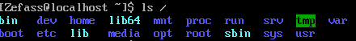

Задание 1

Определите полное имя вашего домашнего каталога, объясните структуру абсолютного пути к каталогу.

Выведите на экран содержимое корневого каталога системы. Опишите назначение основных каталогов системы.

Выведите на экран информацию о вашем пользователе в файле /etc/passwd, используя команду grep.

Выведите «длинный список» файлов (в том числе скрытых), содержащихся в вашем домашнем каталоге. Опишите, что обозначают все столбцы списка.

Задание 2

Создайте каталоги ~/html и ~/archive.

Выведите на экран содержимое каталога /usr/share. Ограничьте длину результата 5 строками. Запишите результат работы команды в файл index.html в каталоге с сайтом.

Проверьте количество строк в файле index.html. Выведите на экран содержимое файла index.html.

Переименуйте каталог html в html_public.

Создайте копию файла index.html в ~/archive.

Выведите список файлов в домашнем каталоге, отсортировав их в порядке, обратном алфавитному. Сохраните вывод в файл ~/html_public/home.html.

Скопируйте в домашний каталог файл home.html.

Создайте символьную ссылку к файлу index.html с именем ~/html_public/link_s.html и жесткую ссылку к этому же файлу с именем ~/html_public/link_h.html.

Удалите файл index.html так, чтобы ссылка link_s.html оказалась «сломанной». Попробуйте открыть содержимое файлов link_s.html и link_h.html.

Определите место, занимаемое в системе вашим сайтом (каталогами html_public и archive).

