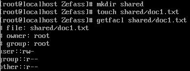

Задание 1

Создайте в своем домашнем каталоге подкаталог labs.

Запустите следующую команду, чтобы создать группу файлов, которыми необходимо распорядиться

Задайте права доступа к вашему домашнему каталогу так, чтобы другие пользователи могли получить доступ к подкаталогу labs, но не могли просматривать список файлов в домашнем каталоге.

Убедитесь, что другие пользователи могут получить доступ и посмотреть список файлов в каталоге labs. Для этого попросите другого пользователя попробовать открыть ваш каталог.
Члены вашей группы должны будут помочь вам с выполнением лабораторных работ. Создайте каталог ~/labs/draft и выдайте вашей группе права доступа к этому каталогу так, чтобы любой мог просмотреть список содержимого каталога, но только студенты вашей группы могли создать новые файлы. Переместите все обычные файлы, которые содержат слово «draft» в своем названии, в ваш вновь созданный каталог и замените группу-владельца файла на вашу группу. mkdir ~/labs/draft
За итоговый вариант файлов с выполненными лабораторными работами отвечаете вы. Создайте каталог ~/labs/final. Вы не хотите, чтобы кто-то мог изменять вашу работу, поэтому установите такие права доступа, чтобы только вы имели доступ к каталогу на запись. Вы должны иметь полный доступ к этому каталогу, а все другие студенты вашей группы должны иметь возможность просматривать файлы этого каталога. Переместите все обычные файлы, которые содержат в своем названии слово «final», во вновь созданный каталог.
Работа над первой лабораторной работой закончилась, поэтому позаботьтесь о том, чтобы вы случайно не удалили файл lab1.final.pdf и lab1.final.txt из каталога final.
Вы хотите иметь место, где можно записывать свои планы по выполнению будущих работ, вы не хотите, чтобы кто-либо увидел ваши мысли. Создайте каталог ~/labs/planning, и установите такие права доступа, чтобы вы имели полный доступ, а все остальные не имели доступа вообще.
Вы заинтересованы в том, чтобы получать от любых людей подсказки по выполнению работ, но вы хотели бы, чтобы этот процесс был анонимным. Создайте каталог ~/labs/submissions и установите такие прав доступа, чтобы любой человек мог создавать новые файлы, но только вы могли видеть список содержимого каталога. Проверьте, что все работает, попросив соседа создать новый файл в вашем каталоге с именем ~/labs/submissions/suggestion.txt.
На всякий случай скопируйте команду /bin/ls как файл ~/labs/ls. Поскольку вы не хотите, чтобы кто-то запустил этот исполняемый файл, удалите все права доступа на выполнение.
Поскольку другие люди будут пользоваться этим каталогом, вы слегка обеспокоены по поводу новых файлов, которые вы будете создавать. Добавьте подходящую команду в конец вашего файла ~/.bashrc, так чтобы umask вашей оболочки автоматические был установлен на 077 при запуске.

Задание 2

Создайте подкаталог shared в вашем домашнем каталоге. Узнайте имя пользователя вашего одногруппника, сидящего за соседним компьютером.
Создайте файл doc1.txt в новом каталоге. Проверьте стандартные права доступа к файлу. Используя списки контроля доступа, дайте вашему соседу права на чтение созданного файла.
Проверьте, что сосед может получить доступ к созданному файлу. В чем может быть причина, если ему не удалось открыть файл?

Договоритесь с соседним пользователем о создании общего каталога. Настройте списки контроля доступа по умолчанию для каталога shared так, чтобы ваш сосед мог создавать новые файлы в нем и иметь права на их чтение и запись.
Попросите соседа создать файл file1.txt и записать в него строку «This text is created by user1». Откройте созданный им файл и допишите в него вторую строку «This text is added by user2»

