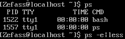
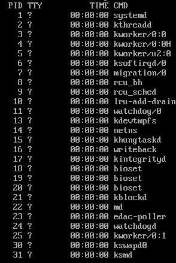
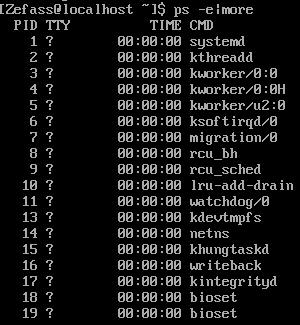
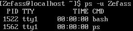
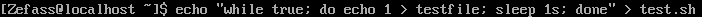
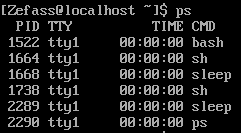
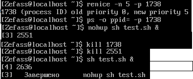

Выведите на экран листинг характеристик (в длинном и коротком форматах) процессов, инициализированных с Вашего терминала. Проанализируйте и объясните содержание каждого поля сообщения.

Выведите на экран листинг характеристик всех процессов. Используйте при необходимости конвейер с more для постраничного просмотра листинга. Какой процесс является родительским для большинства процессов? Что означает символ ? в поле управляющий терминал процесса?

Выведите на экран листинг процессов, запущенных конкретным пользователем. Какой ключ пришлось использовать? Что говорит значение ? в поле управляющий терминал процесса?

Разработайте и запустите простейшую процедуру в фоновом режиме с бесконечным циклом выполнения, предусматривающую, например, перенаправление вывода каких- то сообщений в файл или в фиктивный файл, и использующую команду sleep для сокращения частоты циклов процедуры.

Выполните п. 1. Объясните изменения в листинге характеристик процессов.

Понизьте значение приоритета процедуры. На что и как повлияет эта операция при управлении вычислительным процессом системы? Как отразятся ее результаты в описателях процессов?

Проанализируйте листинг процессов. Какой процесс является родительским для процедуры.

Выйдите из системы и войдите заново. Проанализируйте листинг процессов. Объясните изменения в системе.

Запустите процедуру в фоновом режиме, но предусмотрите ее защиту от прерывания при выходе из системы.

Выполните п.6. Объясните изменения PPID процедуры.

Завершите выполнение процесса процедуры.

Запустите процедуру в интерактивном режиме с перенаправлением вывода в соответствующий файл.

Переведите задание с процедурой в фоновый режим и проанализируйте сообщение на экране. Что пришлось дополнительно сделать? Как выглядят приостановленные процессы в листинге команды ps?

Переведите задание с процедурой в интерактивный режим и проанализируйте сообщение на экране.

